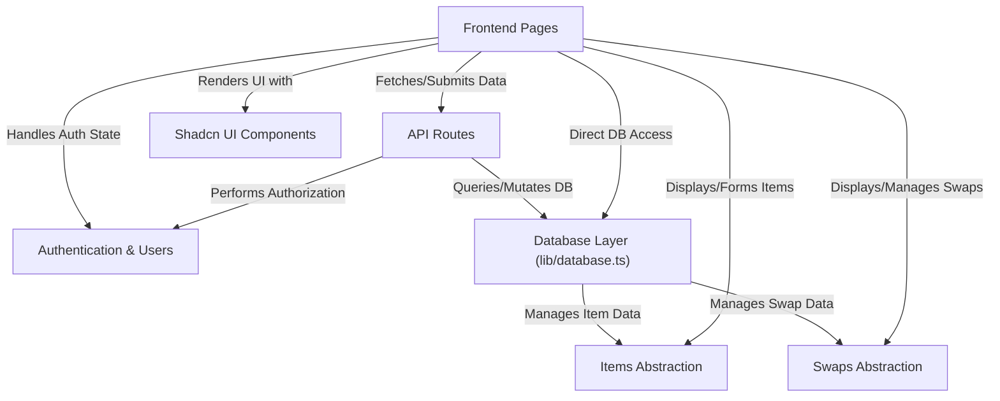

# Odoo CrusadersAlpha - OPTION 3: ReWear

ReWear is an application for swapping clothing items. Users have **authenticated accounts** to manage their profile and interactions.
**Clothing items** they list and **swap requests** they make or receive are stored and managed through a central **database layer**.
The user **interface pages** interact with the database, mostly via **backend API routes**.
All the visible parts of the application are built using a set of reusable **UI components**.

## Visual Overview

## Chapters

1. [Authentication & Users
](01_authentication___users_.md)
2. [Items Abstraction
](02_items_abstraction_.md)
3. [Swaps Abstraction
](03_swaps_abstraction_.md)
4. [Frontend Pages
](04_frontend_pages_.md)
5. [Shadcn UI Components
](05_shadcn_ui_components_.md)
6. [API Routes
](06_api_routes_.md)
7. [Database Layer (lib/database.ts)
](07_database_layer__lib_database_ts__.md)

---
