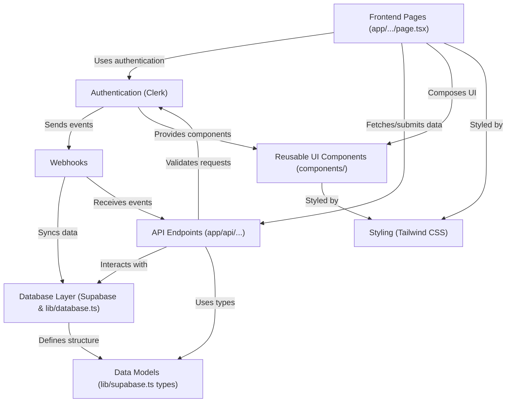

# Odoo CrusadersAlpha - OPTION 3 - ReWear

ReWear is a **sustainable clothing swap platform** that lets users **list** pre-loved fashion items for **swap, donation, or points**.
It provides a marketplace to **browse** items, **request swaps** with other users, and **manage** personal listings and swap requests through a **dashboard**.
The platform focuses on **reducing textile waste** by promoting a **circular fashion economy**.

## Visual Overview

## Chapters

1. [Data Models (`lib/supabase.ts` types)
](01_data_models___lib_supabase_ts__types__.md)
2. [Database Layer (Supabase & `lib/database.ts`)
](02_database_layer__supabase____lib_database_ts___.md)
3. [Authentication (Clerk)
](03_authentication__clerk__.md)
4. [API Endpoints (`app/api/...`)
](04_api_endpoints___app_api_______.md)
5. [Webhooks
](05_webhooks_.md)
6. [Frontend Pages (`app/.../page.tsx`)
](06_frontend_pages___app_____page_tsx___.md)
7. [Reusable UI Components (`components/`)
](07_reusable_ui_components___components____.md)
8. [Styling (Tailwind CSS)
](08_styling__tailwind_css__.md)

---
